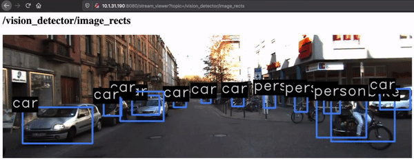

# ArmNN accelerated object detection ROS node for Autoware autonomous driving stack

## Overview

[Autoware.AI](https://www.autoware.ai/) is the world's first "All-in-One"
open-source software for autonomous driving technology. It is based on ROS 1
and the [source code](https://gitlab.com/autowarefoundation/autoware.ai) is
available under Apache 2.0 license.

Object detection is a very important component of Autoware. Detecting traffic
elements in your environment quickly and accurately is crucial for the
successful operation of a autonomous vehicle.

In this tutorial you will learn how to build an object detection node for
Autoware, using ArmNN as the neural network inference engine. We will run this
node on the [HiKey 960](https://www.96boards.org/product/hikey960/) utilizing
its Mali GPU for acceleration.

## Before you begin

Set up the HiKey 960 and build ArmNN following the blog
[here](https://developer.arm.com/solutions/machine-learning-on-arm/developer-material/how-to-guides/running-and-profiling-arm-nn-on-the-hikey-960/),
up to the step
[_add more diskspace_](https://developer.arm.com/solutions/machine-learning-on-arm/developer-material/how-to-guides/running-and-profiling-arm-nn-on-the-hikey-960/add-more-diskspace)
where you run `./build-armnn.sh` on the HiKey to build Armnn.

We will assume you have internet connection on the HiKey and can access it via
SSH. You will also need access to a linux host machine where you can run some
bash script in one of the steps below.

## Make space on the root partition

We will have to install a lot of packages on the HiKey, hence we need to move
some stuff from the root partition to the newly created user disk partition.

You can run the script `scripts/make_space.sh` which will move `/var/cache` and
`/usr/lib/aarch64-linux-gnu` to be under `~/armnn-devenv`.

## Install ROS

Next, we will install [ROS Kinetic](http://wiki.ros.org/kinetic) on the HiKey.
The full tutorial can be found
[here](http://wiki.ros.org/kinetic/Installation/Ubuntu). But you can run the
script `scripts/ros_setup.sh` which will setup the ROS source list and install
the necessary packages.

## Setup the Autoware build environment

Next we need to checkout the source code of autoware and install its
dependencies. The full tutorial can be found
[here](https://gitlab.com/autowarefoundation/autoware.ai/autoware/wikis/Source-Build).
We will be building Autoware 1.12 with ROS Kinetic. You can simply run the
script `scripts/autoware_setup.sh` to setup the environment.

This script will:

- Checkout the autoware source code
- Delete some autoware modules not needed in this demo in order to reduce the
  source and dependency tree
- Install autoware dependencies
- Copy ArmNN includes and libs into `/opt/armnn`. The object detection module
  will expect those files to be there.

At this point, you need to obtain the source code for the ArmNN vision_detector
node and put it in the folder
`~/armnn-devenv/autoware.ai/src/arm/vision_detector`.

## Prepare the Neural Network

The object detection node will run
[yolo v2 tiny](https://pjreddie.com/darknet/yolov2/) in tensorflow pb format. We
need to convert the network from its original darknet format to tensorflow
format. Detailed tutorial can be found
[here](https://github.com/thtrieu/darkflow). But you can simply run the script
`./scripts/get_yolo_tiny_v2.sh`. This script should be run on the host to
conserve disk space on the HiKey. After running the script you will find a file
called `yolo_v2_tiny.pb` file in your current directory. Copy this file to the
object detection node source tree on the HiKey.

```sh
> # On your host machine, run the following
> ./scripts/get_yolo_tiny_v2.sh
> scp yolo_v2_tiny.pb arm01@<ip address of the HiKey>:~/armnn-devenv/autoware.ai/src/arm/vision_detector/models
```

## Build the vision_detector node

Navigate to the top level autoware folder and run the following:

```txt
> colcon build --packages-up-to vision_detector
```

In order to verify the build, you can run some unit tests

```txt
> colcon test --packages-select vision_detector --event-handlers console_cohesion+
```

## Get some demo data

The vision detector node takes images from the topic `/image_raw` and outputs
detections on the topic `/vision_detector/objects`. We will download some images
from the [KITTI dataset](http://www.cvlibs.net/datasets/kitti/raw_data.php) to
feed into `/image_raw`. The following is an example, you can choose any other
sequences on the KITTI dataset page.

```sh
> wget https://s3.eu-central-1.amazonaws.com/avg-kitti/raw_data/2011_09_26_drive_0106/2011_09_26_drive_0106_sync.zip
> # a folder called 2011_09_26 will appear
> unzip 2011_09_26_drive_0106_sync.zip
```

The KITTI data comes in the form of a series of PNG image files. We have
provided a small script to turn it into a rosbag so we can play it back in ROS
easily.

```sh
> # usage: ./images_to_rosbag.py <path to KITTI images folder> <output rosbag name>
> ./images_to_rosbag.py 2011_09_26/2011_09_26_drive_0106_sync/image_02/data/ demo.rosbag
```

## Running the demo

First, Copy the file `demo.rosbag` created in the previous step to the root of
your autoware source code. To run the demo, we need to run 3 things

- Launch object detection node
- Launch web_video_server to be able to view the outputs
- Play back the newly created rosbag in a loop

We have provided a script to do all of that. Simply run the script `run_demo.sh`
from the root of your autoware source code. A webserver is then launched on port
8080 where you can view the output images. Open the following url in your
favorite browser:

```txt
http://<ip address of the HiKey>:8080/stream?topic=/vision_detector/image_rects
```

You will see something like this



## Code walk-through

Success! Now we will walk through the code and highlight some of the key
functional points for using ArmNN's C++ API.

`vision_detector_node.cpp` contains the entry point for the ROS node. The
following code initializes the ROS node and registers it with ros master:

```cpp
  ros::init(argc, argv, "vision_detector");
```

An ArmNN runtime object is first created:

```cpp
  // Create ArmNN Runtime
  armnn::IRuntime::CreationOptions options;
  options.m_EnableGpuProfiling = false;
  armnn::IRuntimePtr runtime = armnn::IRuntime::Create(options);
```

Then the we proceed to load the pre-trained network from a file

```cpp
  // Enumerate Compute Device backends
  std::vector<armnn::BackendId> computeDevices;
  computeDevices.push_back(armnn::Compute::GpuAcc);
  computeDevices.push_back(armnn::Compute::CpuAcc);
  computeDevices.push_back(armnn::Compute::CpuRef);

  detector_armnn::Yolo2TinyDetector<DataType> yolo(runtime);
  yolo.load_network(pretrained_model_file, computeDevices);
```

`armnn_yolo2tiny.hpp` contains the definition for `Yolo2TinyDetector` where we
call ArmNN to parse the network file:

```cpp
  // Setup ArmNN Network
  // Parse pre-trained model from TensorFlow protobuf format
  using ParserType = armnnTfParser::ITfParser;
  auto parser(ParserType::Create());
  armnn::INetworkPtr network{nullptr, [](armnn::INetwork *) {}};
  network = parser->CreateNetworkFromBinaryFile(model_path.c_str(), inputShapes,
                                                requestedOutputs);
```

This network is then optimized and loaded into the ArmNN runtime:

```cpp
  // Set optimisation options
  armnn::OptimizerOptions options;
  options.m_ReduceFp32ToFp16 = false;

  // Optimise network
  armnn::IOptimizedNetworkPtr optNet{nullptr,
                                     [](armnn::IOptimizedNetwork *) {}};
  optNet = armnn::Optimize(*network, compute_devices, runtime->GetDeviceSpec(),
                           options);
  if (!optNet) {
    throw armnn::Exception("armnn::Optimize failed");
  }

  // Load network into runtime
  armnn::Status ret =
      this->runtime->LoadNetwork(this->networkID, std::move(optNet));
  if (ret == armnn::Status::Failure) {
    throw armnn::Exception("IRuntime::LoadNetwork failed");
  }
```

Now we are ready to run inference. Every time an image is published to the ROS
topic `/image_raw`, the callback function `DetectorNode<T>::callback_image` is
invoked which will call `Yolo2TinyDetector<T>::run_inference` which in turn
calls ArmNN to execute the inference:

```cpp
  // Allocate output container
  size_t output_size = this->output_tensor_shape.GetNumElements();
  std::vector<T> output(output_size);

  // Create input and output tensors and their bindings
  armnn::InputTensors inputTensors{
      {0,
       armnn::ConstTensor(this->runtime->GetInputTensorInfo(this->networkID, 0),
                          input_tensor.data())}};
  armnn::OutputTensors outputTensors{
      {0, armnn::Tensor(this->runtime->GetOutputTensorInfo(this->networkID, 0),
                        output.data())}};

  // Run inference
  this->runtime->EnqueueWorkload(this->networkID, inputTensors, outputTensors);
```

The output of the inference is decoded in the function
`Yolo2TinyDetector<T>::process_output`. We apply a score threshold and
[non_maximum_suppression](https://towardsdatascience.com/non-maximum-suppression-nms-93ce178e177c)
algorithm to remove spurious detections before output the final detection in
`autoware_msgs::DetectedObjectArray` format.
