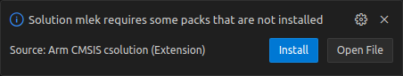
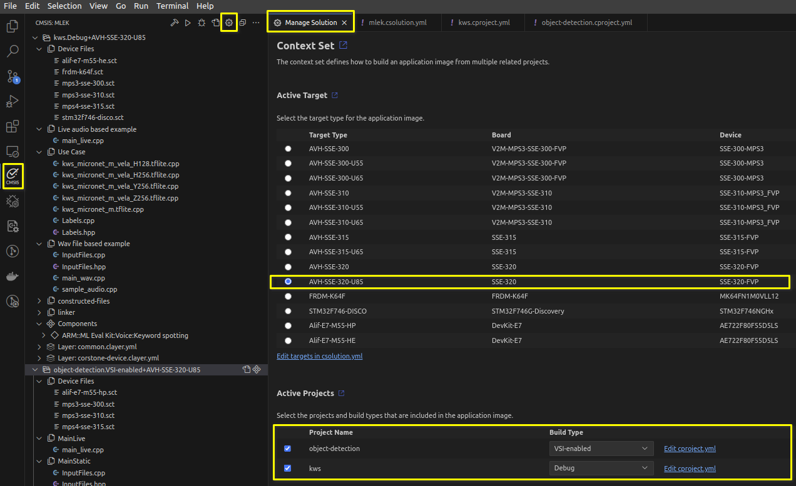

# CMSIS-Pack based Machine Learning Examples

- [CMSIS-Pack based Machine Learning Examples](#cmsis-pack-based-machine-learning-examples)
- [Introduction](#introduction)
  - [Examples](#examples)
  - [Target platforms](#target-platforms)
- [Overview](#overview)
  - [Object detection](#object-detection)
  - [Keyword spotting](#keyword-spotting)
- [Prerequisites](#prerequisites)
  - [Support for Visual Studio Code](#support-for-visual-studio-code)
  - [Tools](#tools)
  - [Packs](#packs)
- [Building the examples](#building-the-examples)
  - [Download Software Packs](#download-software-packs)
  - [Generate and build the project](#generate-and-build-the-project)
  - [Application output](#application-output)
- [Trademarks](#trademarks)
- [Licenses](#licenses)
- [Troubleshooting and known issues](#troubleshooting-and-known-issues)

# Introduction

This repository contains Machine Learning (ML) examples using the CMSIS-Pack from
[ML Embedded Evaluation Kit](https://review.mlplatform.org/plugins/gitiles/ml/ethos-u/ml-embedded-evaluation-kit/+/refs/heads/main).

## Examples
Currently, the following examples are supported:

- **Object detection** - detects objects in the input image.
- **Keyword spotting** - detects specific keywords in the input audio stream.

## Target platforms

Target platforms supported:

| Name                | Type                | IP                                            | Examples |
|---------------------|---------------------|-----------------------------------------------|----------|
| Arm® Corstone™-300  | Virtual or physical | Arm® Cortex®-M55 CPU with Arm® Ethos™-U55 or Arm® Ethos™-U65 NPU | All      |
| Arm® Corstone™-310  | Virtual or physical | Arm® Cortex®-M85 CPU with Arm® Ethos™-U55 or Arm® Ethos™-U65 NPU | All      |
| Alif Ensemble E7    | Physical board      | Arm® Cortex®-M55 CPU with Arm® Ethos™-U55 NPU | All      |
| STM32F746G-Discovery| Physical board      | Arm® Cortex®-M7 CPU                           | KWS      |
| NXP FRDM-K64F       | Physical board      | Arm® Cortex®-M4 CPU                           | KWS      |


Use this import button to open the solution in Keil Studio Cloud: [![Open in Keil Studio](https://img.shields.io/badge/Keil%20Studio-Import-blue?logo=data:image/svg+xml;base64,PD94bWwgdmVyc2lvbj0iMS4wIiBlbmNvZGluZz0idXRmLTgiPz4NCjwhLS0gR2VuZXJhdG9yOiBBZG9iZSBJbGx1c3RyYXRvciAyNS40LjEsIFNWRyBFeHBvcnQgUGx1Zy1JbiAuIFNWRyBWZXJzaW9uOiA2LjAwIEJ1aWxkIDApICAtLT4NCjxzdmcgdmVyc2lvbj0iMS4xIiBpZD0iTGF5ZXJfMSIgeG1sbnM9Imh0dHA6Ly93d3cudzMub3JnLzIwMDAvc3ZnIiB4bWxuczp4bGluaz0iaHR0cDovL3d3dy53My5vcmcvMTk5OS94bGluayIgeD0iMHB4IiB5PSIwcHgiDQoJIHZpZXdCb3g9IjAgMCA0NyAxNCIgc3R5bGU9ImVuYWJsZS1iYWNrZ3JvdW5kOm5ldyAwIDAgNDcgMTQ7IiB4bWw6c3BhY2U9InByZXNlcnZlIj4NCjxzdHlsZSB0eXBlPSJ0ZXh0L2NzcyI+DQoJLnN0MHtmaWxsOiNGRkZGRkY7fQ0KPC9zdHlsZT4NCjxwYXRoIGNsYXNzPSJzdDAiIGQ9Ik00LjcsN2MwLDIuMiwxLjQsNC4xLDMuNSw0LjFjMS44LDAsMy42LTEuNCwzLjYtNC4xYzAtMi44LTEuNy00LjItMy42LTQuMkM2LjIsMi45LDQuNyw0LjcsNC43LDcgTTExLjYsMC41DQoJaDIuOXYxM2gtMi45di0xLjNjLTAuOSwxLjEtMi4zLDEuNy0zLjcsMS43QzQsMTMuOSwxLjgsMTAuNiwxLjgsN2MwLTQuMywyLjctNi45LDYuMS02LjljMS41LDAsMi44LDAuNywzLjcsMS45VjAuNXoiLz4NCjxwYXRoIGNsYXNzPSJzdDAiIGQ9Ik0xOCwwLjVIMjF2MS4yYzAuMy0wLjQsMC43LTAuOCwxLjItMS4xYzAuNS0wLjMsMS4yLTAuNCwxLjctMC40YzAuOCwwLDEuNiwwLjIsMi4zLDAuNmwtMS4yLDIuOA0KCWMtMC40LTAuMy0xLTAuNC0xLjUtMC40Yy0wLjctMC4xLTEuMywwLjItMS44LDAuN0MyMSw0LjYsMjEsNS45LDIxLDYuOHY2LjdIMThWMC41eiIvPg0KPHBhdGggY2xhc3M9InN0MCIgZD0iTTI4LjIsMC41aDIuOXYxLjJjMC43LTAuOSwxLjktMS42LDMuMS0xLjZjMS4zLDAsMi42LDAuNywzLjIsMS45YzAuOS0xLjIsMi4yLTEuOSwzLjctMS45DQoJQzQyLjcsMCw0NCwwLjksNDQuNywyLjJjMC4yLDAuNCwwLjcsMS40LDAuNywzLjN2OC4xaC0yLjlWNi4zYzAtMS41LTAuMi0yLjEtMC4yLTIuM2MtMC4yLTAuNy0wLjktMS4yLTEuNy0xLjENCgljLTAuNywwLTEuMywwLjMtMS43LDAuOWMtMC41LDAuOC0wLjYsMS45LTAuNiwyLjl2Ni43aC0yLjlWNi4zYzAtMS41LTAuMi0yLjEtMC4yLTIuM2MtMC4yLTAuNy0wLjktMS4yLTEuNy0xLjENCgljLTAuNywwLTEuMywwLjMtMS43LDAuOWMtMC41LDAuOC0wLjYsMS45LTAuNiwyLjl2Ni43aC0yLjlMMjguMiwwLjV6Ii8+DQo8L3N2Zz4NCg==&logoWidth=47)](https://studio.keil.arm.com/?import=https://github.com/Arm-Examples/mlek-cmsis-pack-examples.git)

# Overview

The examples presented in this repository showcase how to build and deploy end-to-end Machine
Learning applications using existing code from various CMSIS-packs. These examples are built
using Google's [TensorFlow Lite Micro framework](https://www.tensorflow.org/lite/microcontrollers)
and Arm's [ML Embedded Evaluation Kit](https://review.mlplatform.org/plugins/gitiles/ml/ethos-u/ml-embedded-evaluation-kit/+/refs/heads/main/Readme.md)
API's. The embedded evaluation kit API pack has ready-to-use machine learning API's for several
use cases covering typical `voice`, `vibration` and `vision` applications.

Although the primary target platforms for this repository are Arm® Corstone™-300 and Corstone™-310,
the Keyword spotting (KWS) project can be built for physical targets too. The examples are set
up to use the NPU (if available) by default with unsupported operators falling back on the CPU.
Therefore, the neural network model files used for Corstone™-300 and Corstone™-310 have been
pre-optimised by the [Vela compiler](https://pypi.org/project/ethos-u-vela/) while the files
used for pure CPU targets are used as they are.

## Object detection

This example uses a neural network model that specialises in detecting human faces in images.
The input size for these images is 192x192 (monochrome) and the smallest face that can be
detected is of size 20x20. The output of the application will be co-ordinates for rectangular
bounding boxes for each detection.

## Keyword spotting

This example can detect up to twelve keywords in the input audio stream. The
[audio file used](./resources/sample_audio.wav) contains the keyword "down" being spoken.

More details about the input for this example can be found [here](https://review.mlplatform.org/plugins/gitiles/ml/ethos-u/ml-embedded-evaluation-kit/+/refs/heads/main/docs/use_cases/kws.md#preprocessing-and-feature-extraction).


# Prerequisites

## Visual Studio Code

We recommend using [Visual Studio Code IDE](https://code.visualstudio.com/) with the
[Keil Studio Pack Extension](https://marketplace.visualstudio.com/items?itemName=Arm.keil-studio-pack).
Alternatively, [Keil Studio Cloud](https://studio.keil.arm.com/?import=https://github.com/Arm-Examples/mlek-cmsis-pack-examples.git) can also be used.

Once the IDE has been set up with the extension, it presents an easy to use interface to build
applications for specific configurations of the different projects and targets from within VS Code,
and also helps with debugging and flashing.

For developing on a local host machine, we recommend a Linux based system as we test
the flow of the instructions in that environment, but a Windows based machine should
also work.

## Packs

CMSIS-Pack defines a standardized way to deliver software components, device parameters and board
support information and code. A list of available CMSIS-Packs can be found
[here](https://developer.arm.com/tools-and-software/embedded/cmsis/cmsis-packs).


# Building the examples

## Launch project in Visual Studio Code

Upon opening the project in Visual Studio Code, `vcpkg` will automatically install the required packages as specified in the manifest file [vcpkg-configuration.json](vcpkg-configuration.json).

## Download Software Packs

Once `vcpkg` has finished configuring the environment, a prompt will appear to install the required CMSIS packs for this project:



Alternatively, the packs can be installed manually be opening up a Terminal in Visual Studio Code (Ctrl + Shift + `) and running the following commands:

```
$ csolution list packs -s mlek.csolution.yml -m > packlist.txt
$ cpackget add -f packlist.txt
```

## Generate and build the project

Use the CMSIS tab in the Activity Bar to build, run and debug the use case samples for a particular target type.



Simply use the drop-down menus to specify your build, then click the Build button.  The output should look similar to the following:

```log
 *  Executing task: Workspace: cmsis-csolution.build: Build

info cbuild: Build Invocation 2.0.0 (C) 2023 Arm Ltd. and Contributors
/home/armuser/Development/ML-examples/cmsis-pack-examples/object-detection/object-detection.Debug+AVH-SSE-300-U55.cprj - info csolution: file generated successfully
/home/armuser/Development/ML-examples/cmsis-pack-examples/object-detection/object-detection.Debug+AVH-SSE-300-U55.cbuild.yml - info csolution: file is already up-to-date
/home/armuser/Development/ML-examples/cmsis-pack-examples/mlek.cbuild-idx.yml - info csolution: file is already up-to-date
info cbuild: Processing 1 context(s)
===============================================================================
info cbuild: (1/1) Processing context: "object-detection.Debug+AVH-SSE-300-U55"
info cbuild: clean finished successfully!

M650: Command completed successfully.

M652: Generated file for project build: '/home/armuser/Development/ML-examples/cmsis-pack-examples/tmp/object-detection/AVH-SSE-300-U55/Debug/CMakeLists.txt'
-- The C compiler identification is ARMClang 6.20.2
-- The CXX compiler identification is ARMClang 6.20.2
-- Detecting C compiler ABI info
-- Detecting C compiler ABI info - done
-- Check for working C compiler: /home/armuser/.config/Code/User/globalStorage/ms-vscode.vscode-embedded-tools/vcpkg/root/downloads/artifacts/vcpkg-artifacts-arm/compilers.arm.armclang/6.20.0/bin/armclang - skipped
-- Detecting C compile features
-- Detecting C compile features - done
-- Detecting CXX compiler ABI info
-- Detecting CXX compiler ABI info - done
-- Check for working CXX compiler: /home/armuser/.config/Code/User/globalStorage/ms-vscode.vscode-embedded-tools/vcpkg/root/downloads/artifacts/vcpkg-artifacts-arm/compilers.arm.armclang/6.20.0/bin/armclang - skipped
-- Detecting CXX compile features
-- Detecting CXX compile features - done
-- Registered toolchain version 6.20.0 does not match running version 6.20.2
-- Configuring done
-- Generating done
-- Build files have been written to: /home/armuser/Development/ML-examples/cmsis-pack-examples/tmp/object-detection/AVH-SSE-300-U55/Debug
[1/257] Building C object CMakeFiles/object-detection.dir/home/armuser/.cache/arm/packs/ARM/V2M_MPS3_SSE_300_BSP/1.3.0/Native_Driver/systimer_armv8-m_timeout.o
...
...
[257/257] Linking CXX executable /home/armuser/Development/ML-examples/cmsis-pack-examples/out/object-detection/AVH-SSE-300-U55/Debug/object-detection.axf
Warning: L6439W: Multiply defined Global Symbol flatbuffers::flatbuffer_version_string defined in .data._ZN11flatbuffers25flatbuffer_version_stringE(Model.o) rejected in favor of Symbol defined in .data._ZN11flatbuffers25flatbuffer_version_stringE(Classifier.o).
...
...
"/home/armuser/Development/ML-examples/cmsis-pack-examples/object-detection/linker/mps3-sse-300.sct", line 104 (column 14): Warning: L6314W: No section matches pattern *.o(activation_buf_dram).
Finished: 0 information, 129 warning and 0 error messages.
info cbuild: build finished successfully!
Build complete
 *  Terminal will be reused by tasks, press any key to close it.
```

The built artifacts will be located under the `out/` directory in the project root.

## Execute project

The project is configured for execution on Arm Virtual Hardware which removes the requirement for
a physical hardware board.

- When using a Fixed Virtual Platform installed locally:
  ```shell
  $ <path_to_installed_FVP> -a ./out/kws/AVH-SSE-300-U55/Debug/kws.Debug+AVH-SSE-300-U55.axf -C ethosu.num_macs=256
  ```
  > **NOTE**: The FVP defaults to running 128 MAC configuration for Arm® Ethos™-U55 NPU.
  > However, our default neural network model for the NPU is for 256 MAC configuration.

- [Keil Studio Cloud](https://studio.keil.arm.com/) integrates also the Arm Virtual Hardware
  VHT_Corstone_SSE-300_Ethos-U55 model. The steps to use the example are:
  - Start [Keil Studio Cloud](https://studio.keil.arm.com/) and login to the system using your
    account.
  - Drag and drop this directory (cmsis-pack-examples) into the project pane, or use the import
    button provided above, under [ML-examples](#ml-examples).
  - Select the *Active Project* from the drop-down - it should show all projects referenced in
    the `csolution` file.
  - Select *Target hardware* from the drop-down: **SSE-300 MPS3**
  - Click **Run project** which executes the project build step and then starts running on Arm
    Virtual Hardware.

> **Note:** Arm Virtual Hardware models are also available on AWS Marketplace.

For physical targets supported, the boards should enumerate as mass storage devices once connected
via USB to the host machine. Once this happens, copy over the bin file from the generated build
to this storage device. Once copied the mass storage device will automatically disconnect,
re-enumerate and start the program it has been just flashed with.

For example:

```shell
$ cp ./out/kws/STM32F746-DISCO/Release/kws.Release+STM32F746-DISCO.bin /media/user/DIS_F746NG/ && sync
```

## Application output

Once the project can be built successfully, the execution on target hardware will show output of
the application in `Output` window in Keil Studio Cloud. Currently, this includes the following:
  - Arm® Ethos™-U55 NPU version information
  - Information about model's memory allocation
  - Running inference on specified input
  - Output of inference
  - Simulation information such as simulated time, user time, system time, etc

Note that most applications will redirect their standard output and error streams to a UART module.
Keil Sudio Cloud has an option to open a serial connection that can be used to monitor these
streams.

For the Alif Semiconductor's Ensemble DevKit boards, the output over UART is not wired though any
USB. A 1.8V FTDI USART cable is recommended to view the serial output. By default, the high
performance core uses UART device 4, and the high efficiency core uses UART device 2. Check the
board schematic to see which pins these modules use. For the Rev1 version of the board the pins
are:

```
UART2 RX_B on J413 pin 13 (P3_16) ↔ FTDI TX
UART2 TX_B on J413 pin 14 (P3_17) ↔ FTDI RX
UART4 RX_B on J412 pin 11 (P3_1)  ↔ FTDI TX
UART4 TX_B on J412 pin 12 (P3_2)  ↔ FTDI RX
```
For all other targets, serial is available over USB from primary debug/connection port.

Sample output for `STM32F746G-DISCO` target:

```
INFO - Added  support to op resolver
INFO - Creating allocator using tensor arena at 0x20000460
INFO - Allocating tensors
INFO - Model INPUT tensors:
INFO -  tensor type is INT8
INFO -  tensor occupies 490 bytes with dimensions
INFO -          0:   1
INFO -          1:  49
INFO -          2:  10
INFO -          3:   1
INFO - Quant dimension: 0
INFO - Scale[0] = 0.201095
INFO - ZeroPoint[0] = -5
INFO - Model OUTPUT tensors:
INFO -  tensor type is INT8
INFO -  tensor occupies 12 bytes with dimensions
INFO -          0:   1
INFO -          1:  12
INFO - Quant dimension: 0
INFO - Scale[0] = 0.056054
INFO - ZeroPoint[0] = -54
INFO - Activation buffer (a.k.a tensor arena) size used: 103484
INFO - Number of operators: 14
INFO -  Operator 0: CONV_2D
INFO -  Operator 1: DEPTHWISE_CONV_2D
INFO -  Operator 2: CONV_2D
INFO -  Operator 3: DEPTHWISE_CONV_2D
INFO -  Operator 4: CONV_2D
INFO -  Operator 5: DEPTHWISE_CONV_2D
INFO -  Operator 6: CONV_2D
INFO -  Operator 7: DEPTHWISE_CONV_2D
INFO -  Operator 8: CONV_2D
INFO -  Operator 9: DEPTHWISE_CONV_2D
INFO -  Operator 10: CONV_2D
INFO -  Operator 11: AVERAGE_POOL_2D
INFO -  Operator 12: CONV_2D
INFO -  Operator 13: RESHAPE
AUDIO recording configured from digital microphones (U20 & U21)
INFO - Inference #: 7
INFO - Detected: stop; Prob: 0.94
INFO - Inference #: 20
INFO - Detected: left; Prob: 0.98
```

The output is different for the two example applications:
  - object detection application will detect two objects on the sample input image and will
    present the detected bounding boxes for objects in the image.
  - keyword spotting application will detect a keyword in the sample audio file and will present
    the highest confidence score and the associated keyword label.

For STM32F746G-DISCO board, the LCD is also used to display the last keyword detected.


# Trademarks

- Arm® and Cortex® are registered trademarks of Arm® Limited (or its subsidiaries) in the US and/or elsewhere.
- Arm® and Ethos™ are registered trademarks or trademarks of Arm® Limited (or its subsidiaries) in the US and/or
  elsewhere.
- Arm® and Corstone™ are registered trademarks or trademarks of Arm® Limited (or its subsidiaries) in the US and/or
  elsewhere.
- Arm®, Keil® and µVision® are registered trademarks of Arm Limited (or its subsidiaries) in the US and/or elsewhere.
- TensorFlow™, the TensorFlow logo, and any related marks are trademarks of Google Inc.
- ST®, STM32® are registered trademarks of companies belonging to the STMicroelectronics Group.
- NXP® and the NXP logo are trademarks of NXP B.V.
- Alif™, Alif Semiconductor™, Crescendo™ and Ensemble™ are all trademarks of Alif Semiconductors.
- Visual Studio Code, VS Code, and the Visual Studio Code icon are trademarks of Microsoft Corporation.

# Licenses

The application samples and [resources](./resources) are provided under the Apache 2.0 license, see [License](./LICENSE).

Application input data sample files (audio or image files) and the neural network model files have
been converted into C/C++ type arrays and are distributed under Apache 2.0 license. The models have
been processed by the [Vela compiler](https://pypi.org/project/ethos-u-vela/) and then converted
into C/C++ arrays to be baked into the example applications.

| Example | Licence | Provenance |
|---------------|---------|---------|
| Keyword Spotting | Apache 2.0 | [micronet_medium](https://github.com/ARM-software/ML-zoo/raw/9f506fe52b39df545f0e6c5ff9223f671bc5ae00/models/keyword_spotting/micronet_medium/tflite_int8/) |
| Object Detection | Apache 2.0 | [yolo-fastest_192_face_v4](https://github.com/emza-vs/ModelZoo/blob/v1.0/object_detection/) |

# Troubleshooting and known issues

Many of the tools we have used are still in beta testing phase and there can be issues we don't
spot immediately. Please help us improve this section by reporting them via GitHub.

1. Project `not recognised as valid` by Keil Studio Cloud.

   This can happen for several reasons:
   - there are errors in the yml configuration files (csolution, cproject and/or clayer).
     Please ensure the schema verification is aligned with the tool version being used.
     For example, if csolution version 1.2.0 is being used, the schema check link on top
     of the yml should reflect this. This is not a strict requirement, but can help catch
     these errors quickly.
   - the csolution yml file is not present at the root of the repository.
   If both the above are not true, try refreshing the webpage and see if it works after refresh.

2. Keil Studio Cloud cannot build the projects for Arm® Corstone™-310 target

   Support for this depends on Arm Compiler 6.18 (or higher) being added to the backend. Until
   Keil Studio Cloud supports this, you can choose to build for this target locally on your
   machine (provided you have Arm Compiler version 6.18 or higher installed).

3. While debugging the KWS application, the STM32F746G board does not recognise keywords at all.

   This is because for a debug configuration the inference process is much slower. It therefore
   skips audio quite easily and the input data, as seen by the application, is not as
   continuous in time as it needs to be for decent detections. The audio capture and inference
   processes are running in parallel, so while the inference is going, or part of the application
   is at a breakpoint, it is quite likely for the audio buffer to be overwriting itself.

4. Keil Studio Cloud does not allow changing the build type to `Release`

   This is a known issue (at the time of writing this) and the feature to switch between build
   types will be made available soon.

5. Project does not build under Keil Studio Cloud.

   This can happen if the Keil Studio Cloud backend tool versions are different to what we
   test against. While we try to develop using the latest versions of the CMSIS toolbox, Keil
   Studio Cloud can be using older versions. If you find an issue, please report it via
   [GitHub](https://github.com/Arm-Examples/mlek-cmsis-pack-examples/issues).

6. Issues running with Arm® Ethos™-U65 NPU on Keil Studio Cloud

   Currently Keil Studio Cloud only supports running with the Arm® Ethos™-U55 on AVH
   virtual targets.
   You can build the project but will have to run it on your local machine on an
   installation of the equivalent Fixed Virtual Platform containing Arm® Ethos™-U65 NPU.